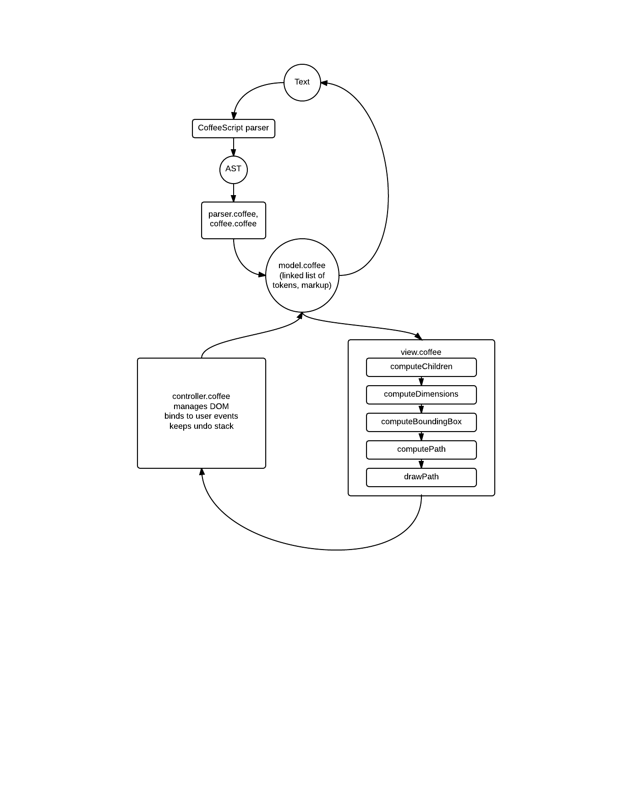

Droplet Editor Architecture
=======================

Ice Editor has five files: `model.coffee`, `view.coffee`, `controller.coffee`, `parser.coffee`, and `coffee.coffee`.

model.coffee
------------
`model.coffee` contains the class definitions for Droplet editor data. Droplet editor data is a linked list of tokens, some of which are XML-style markup (blockStart, blockEnd, etc.). When text is parsed into this linked list, every character (with the exception of leading whitespace) must go into some text token, so reserialization into text simply involves throwing markup away and concatenating the text tokens (except for leading whitespace, which is reinserted).

Every Droplet document is a string of linked-list tokens. A linked-list Token is one of:
  - `documentStart` (only one of these should exist per program)
  - `documentEnd`
  - `blockStart` (the start of a `Block`, which has associated droppability, color, and shape metadata0
  - `blockEnd`
  - `socketStart` (the start of a `Socket`, which has associated droppability metadata)
  - `socketEnd`
  - `indentStart` (the start of an `Indent`, which may have an associated (whitespace) prefix)
  - `indentEnd`
  - `text` (any number of characters without intervening markup, like `"hello there!"`)
  - `newline` (a newline, possibly with an associated `specialIndent` that says it is not at the ordinary indent level for its position)

There are four types of `Container` nodes which can have children:
  - `Document`: can contain `Block`
  - `Block`: can contain `Socket`, `Indent`, or `text`
  - `Socket`: can contain `Block or `text`
  - `Indent`: can contain `Block` or `text`

Additionally, there is a superclass of all these called `List`, which can be instantiated on its own. A bare `List` is simply two pointers into a Model representing a range; unlike `Container`s, it does not own its start or end tokens and is not detectable by scanning through the model. However, a `List` can be passed as an argument whenever splice or similar operations need to be done.

Each `Token`'s location in the `Document` can be gotten as dead data in one of two ways:
  - `getLocation()` returns the number of tokens from the beginning of the document this token is. This is used internally for the undo stack and similar accuracy-sensitive operations.
  - `getTextLocation()` returns a location with four parts: `(row, col, type, length)`, where `length` is the string length of an associated `Container` (if the token is a start or end token) or the string length of the token itself (if it is a text or newline token). This is used externally to allow API users to specify blocks.

Every `Document` can do these three operations to mutate its model, which should be the only way through which the `Document` is mutated. Each takes a final argument which is a collection of `Location`s that the caller wants to track through the mutation.
  - `insert(Token, List, Location[])` -- insert a `List` at the given location, adding or removing whitespace around it as necessary, updating the given `Location`s to point to the same tokens afterward as before.
  - `remove(List, Location[])` -- remove the given `List` from the document, adding or removing whitespace around it as necessary, updating the given `Location`s to point to the same tokens afterward as before. If one of the `Location`s pointed to a token that was removed, it will now point to the token immediately before the start ot the removed list.
  - `replace(List, List, Location[])` -- replace the first `List` with the second without examining whitespace, and attempting to preserve the text position of all the given `Location`s.

Each of these functions returns an undo operation when called, allowing the mutation to be undone by calling `Document.perform(operation, 'backwards')` or redone by calling `Document.perform(operation, 'forwards')`. This will return the `Document` exactly to its prior state.

Every data class will have an associated rendering class in view.coffee, and each data object will contain a pointer to an instance of the corresponding view class. This is so that data generated during rendering can be persistent, as the controller needs to know some things for hit testing.

view.coffee
-----------
`view.coffee` contains the class definitions for the Droplet editor renderers. As mentioned before, each data class in `model.coffee` retains a poiner to a corresponding renderer object.

Rendering is done line-by-line. Each block computes its desired bounding box *on each line*, then draws a path that connects all the bounding boxes.

Rendering occurs in six passes:
  1. `computeChildren`. This runs through the linked list and determines which tokens lie on which lines, and which child blocks occupy which lines.
  2. `computeDimensions`. This recursively computes the size of the bounding box for this block on each given line.
  3. `computeBoundingBox`. This recursively computes the position of the bounding box for this block on each given line.
  4. `computePath`. For blocks that need to draw a path, this connects the bounding boxes into one path for drawing. Simultaneously computes the drop target area, if this block is a valid drop target.
  5. `drawPath`. This actively draws the path on the given canvas.
  6. `drawCursor`. This should be a no-op except for the block that immediately contains the cursor. This occurs in a separate pass from `drawPath` because the cursor must be the topmost object.

controller.coffee
-----------------
`controller.coffee` binds to user events, manages the DOM, and manages the undo stack. It defines the `Editor` class, which is the API-level class, and contains all editor state.

The controller is organized into "features". Features bind to events and give these bindings priorities (for execution order). This is the `hook` function, which takes an event name, a priority, and a handler.

All undo operations are object whose classes descend from `UndoOperation`. They each have an `undo` and `redo` function which can be called on an `Editor` instance.

parser.coffee
-------------
`parser.coffee` is a utility wrapper for Droplet editor parsers. It defines a `Parser` class, which can be instantiated on a parsing function. The parsing function is expected to return an array of markup with locations (e.g. "blockStart at location 5"), and the utility wrapper will generated the linked list from this markup, automatically splicing the original text into `TextToken`s between the returned markup.

coffee.coffee
-------------
`coffee.coffee` defines the parsing function passed to `parser.coffee` for the CoffeeScript blocks. It runs the CoffeeScript standard parser, then transforms the CoffeeScript AST into a markup array using location data.
